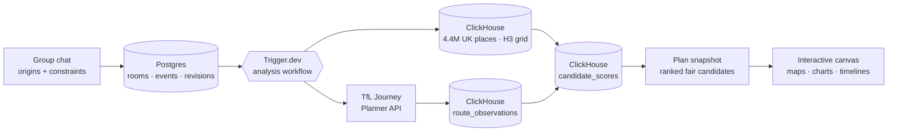

<p align="center">
  
</p>

<p align="center">
  
  
  
  
  
  
  
  
  
  
</p>

**Rendezvous** is a multiplayer AI planning agent that helps a group organise a day out in London — and answers with an interactive visual canvas, not a wall of text.

Everyone joins a room, drops their starting point, and adds their constraints in plain chat: transport preferences, budget, dietary needs, step-free access, "I can't leave before 6pm". Rendezvous then finds the meeting spot that is **fairest for the whole group** — because the geographic midpoint is rarely the fairest place to meet. A spot 20 minutes from everyone beats a spot 5 minutes from one person and 50 from another.

Built for the **ClickHouse & Trigger.dev Virtual Summer Hackathon 2026** — theme: *Beyond the Wall of Text*.

## How it works

Every response that matters is rendered, not written: travel-time contours, participant journey rays, fairness scores, candidate trade-off charts, venue clusters, and a final itinerary timeline on a shared canvas.



The analysis funnel keeps routing cheap and ranking powerful:

1. **Generate candidate areas** in ClickHouse from the group's travel envelope, on the H3 hexagonal grid.
2. **Route each participant** to ~20–30 candidate centroids via the TfL Journey Planner API (Trigger.dev fans these out in parallel).
3. **Score in ClickHouse**: journey time spread, interchanges, walking, accessibility, and venue coverage per cell → a single fairness ranking.
4. **Fetch venues only for the finalists** from the 4.4M-row Foursquare OS Places dataset, matched to the group's food/activity constraints.

## Where ClickHouse and Trigger.dev do the heavy lifting

**ClickHouse Cloud** is the analytical core:

- `places` — a cleaned serving table of **4,438,857 UK Foursquare OS Places**, ordered by H3 cells (`geoToH3` materialized columns) for fast geospatial candidate generation.
- `area_category_counts` — a SummingMergeTree aggregate (2.5M rows) answering "which areas have the venue mix this group wants?" instantly.
- `route_observations` / `candidate_scores` — every journey result and the ranked fairness output of each analysis run.
- Incremental materialized views transform raw ingested data into serving tables on insert; schema is fully codified in versioned SQL migrations.

**Trigger.dev** orchestrates every analysis:

- A workflow per room revision: wait for replicated state → generate candidates → fan out route calculations in parallel → insert observations → rank in ClickHouse → write the plan snapshot back to Postgres.
- Progress streams to the canvas while it runs ("Comparing 30 candidate areas… calculating 120 journeys…").

**ClickHouse Managed Postgres** (via Drizzle ORM) is the transactional source of truth: rooms, participants, constraints, votes, messages, and an append-only `room_events` log with per-room revisions — the backbone for reproducible analyses and (via CDC) plan-evolution analytics.

## Monorepo layout

| Path | What it is |
| --- | --- |
| `apps/web` | Next.js 16 app — chat, shared canvas, API routes |
| `packages/db` | `@workspace/db` — Drizzle schema + Postgres client, ClickHouse client + SQL migrations for both databases |
| `packages/tasks` | `@workspace/tasks` — Trigger.dev workflows |
| `packages/ui` | `@workspace/ui` — shared shadcn/ui components (Base UI + Tailwind v4) |
| `packages/eslint-config` / `packages/typescript-config` | shared tooling configs |

## Getting started

Requires Node ≥ 20 and pnpm 10.

```bash
pnpm install

# one-time env setup
cp .env.example .env          # fill in database credentials
ln -s ../../.env apps/web/.env
ln -s ../../.env packages/tasks/.env

# apply database migrations
pnpm --filter @workspace/db db:migrate   # Postgres (Drizzle)
pnpm --filter @workspace/db ch:migrate   # ClickHouse

# verify both databases end-to-end
pnpm --filter @workspace/db smoke

# run it
pnpm dev                                  # Next.js app
npx trigger.dev@latest dev                # Trigger.dev worker (from packages/tasks)
```

`GET /api/health` reports live connectivity to both databases.

### Database workflows

```bash
pnpm --filter @workspace/db db:generate   # new Postgres migration from schema changes
pnpm --filter @workspace/db db:migrate    # apply Postgres migrations
pnpm --filter @workspace/db ch:migrate    # apply ClickHouse migrations (numbered SQL files)
pnpm --filter @workspace/db db:studio     # browse Postgres with Drizzle Studio
```

Applied migrations are immutable (enforced by Drizzle's journal and `clickhouse-migrations` checksums) — always add a new file.

## License

[Apache 2.0](LICENSE)
